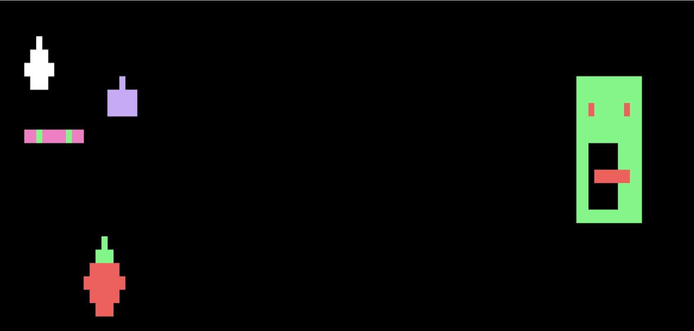

/*# Game Simulation with Screen Objects

## Overview
This project showcases a terminal-based game that simulates interactions among various "screen objects" including Wrigglers, Snakes, Stones, and Poop. Each object is controlled in real-time via multithreading to handle movements and interactions dynamically within a pixel matrix environment.
## How to Run: 
Make all -> ./p1
## Features
- **Multithreading**: Each game object operates in its own thread, ensuring real-time response to user inputs and inter-object collisions.
- **Collision Detection**: Objects react upon colliding with one another, which can lead to a game object being stopped or altered in its path.
- **Dynamic Interaction**: The game continuously updates the positions and states of each object based on predefined movement patterns and user interactions.
- **Terminal Graphics**: Utilizes a custom `PixelMatrix` for rendering objects in the terminal, providing a simple yet effective graphical representation of the game state.

## Game Logic
- **Monsters and Predation**: In the game, a Monster will eat both Snake and Jake, but will avoid eating Poop. Additionally, the Stone behaves similarly, consuming both Jake and Snake.
- **Timed Gameplay**: The game is designed to run for only 30 seconds. After this period, the game will end automatically, although players can exit earlier by pressing 'q'.

### Character Appearances

#### Monster (Jill)
- **Appearance**: The Monster is depicted as a large, green creature with red eyes and a menacing mouth with red teeth. It has a solid green body except for the mouth area, which is empty to highlight its teeth.
- **Dimensions**: 11x11 pixels.

#### Apple (Jake)
- **Appearance**: Jake resembles a red apple with a green leaf on top. The main body is red, with a distinctive leaf adding a touch of green at the top.
- **Dimensions**: 7x7 pixels.

#### Sam (snake)
- **Appearance**: The Snake is rendered in a vibrant purple with two green eyes to add a contrasting color. Its body stretches horizontally across the game grid.
- **Dimensions**: 10x1 pixels.

#### Rock (Stone)
- **Appearance**: The Stone is shaped like a square with a pointed top, colored in deep blue. It provides a simple yet distinctive appearance on the game grid.
- **Dimensions**: 5x3 pixels.

#### Poo (Poop)
- **Appearance**: Poop has a playful design resembling a swirl, rendered in a dark salmon color. This makes it visually distinctive and less realistic.
- **Dimensions**: 5x4 pixels.

Each character's design not only adds visual appeal but also helps in identifying them quickly during gameplay, enhancing the player's interaction experience.

## How to Play
- Launch the game from a terminal that supports ANSI escape codes.
- The game starts automatically, displaying various objects moving around the pixel matrix.
- The game will run for 15 seconds, but if you wish to quit earlier, press 'q'.

## Installation
1. Clone the repository to your local machine.
2. Ensure you have a C++ compiler that supports C++20.
3. Compile the program using the makefile provided or manually using the following command:
4. Run the executable in a compatible terminal.

## Code Structure
- **Terminal.h/cpp**: Handles the terminal display and input.
- **Wriggler.h/cpp**: Base class for movable objects in the game.
- **Snake.h/cpp, Stone.h/cpp, Poop.h/cpp**: Specialized implementations of Wrigglers with unique behaviors.
- **PixelMatrix.h/cpp**: Manages the graphical output to the terminal.
- **ScreenManager.h/cpp**: Coordinates the game loop and object interactions.

## System Requirements
- A Unix-like terminal that supports threading and ANSI escape sequences for cursor control.
- G++ compiler with C++20 support.

## Author
- Isaac Yushaiyin

Enjoy the game, and feel free to contribute or suggest improvements!
*/
